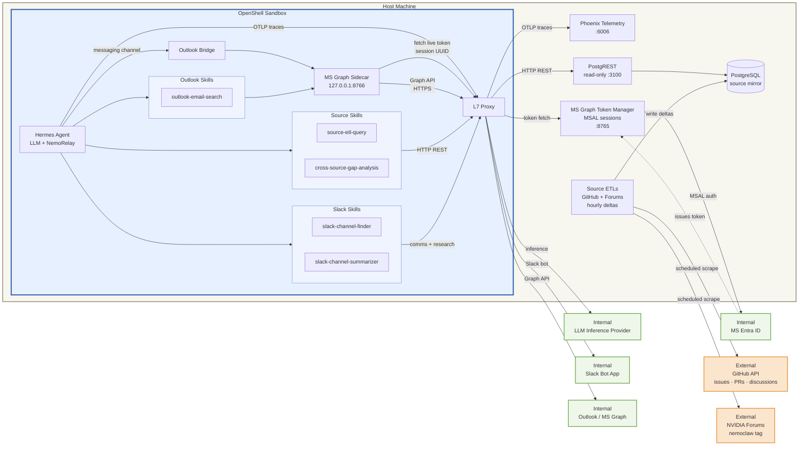

# personal-community-sentiment-triage: Hermes + Outlook

A personal Hermes agent that surfaces what the developer community is working
on, struggling with, asking about, and flagging as gaps — and compares it
against what internal developer/product teams are prioritizing, so resources
can be aligned against actual community demand. The agent draws on signal
from GitHub issues, NVIDIA forums, and Slack channels; you interact with it
via Outlook email and/or Slack. Outlook is the recommended primary channel,
but either is enough on its own — at least one of the two must be configured.

## Architecture

The Hermes sandbox operates with a deliberately narrow egress policy. It connects
live to Slack and Outlook for interactions and research. GitHub and NVIDIA forum
data are never fetched live from inside the sandbox — host-side ETL containers
scrape those sources on a schedule and write results into Postgres, and the
sandbox queries that mirror through a read-only PostgREST HTTP bridge.



**Key invariants:**

- The agent never has direct network access to GitHub or the NVIDIA forums. All GitHub and forum data the agent sees comes from the Postgres mirror.
- Slack and Outlook are live connections from the sandbox; the agent can read and write both in real time.
- Compatible-endpoint inference egress is required for the agent's LLM calls — it's not a research/data-ingestion path.
- The ETL containers are non-agentic — fixed scraper logic on an hourly interval, no LLM involvement.
- The PostgREST bridge exposes a read-only HTTP API on host port `3100`, and the sandbox reaches it through `host.openshell.internal` without any live GitHub or forum egress.

## Agent skills

Skills are loaded on demand by the agent when relevant to a task. They live in [agents/hermes/skills/](agents/hermes/skills/).

| Skill | Purpose |
|-------|---------|
| `source-etl-query` | Query the host-side PostgREST bridge for mirrored GitHub and NVIDIA forum data. Primary data-access skill for both GitHub and forum research. |
| `slack-channel-finder` | Discover Slack channels by topic, team, or domain and infer what each channel is for. |
| `slack-channel-summarizer` | Resolve Slack channels by name or ID and read message history via the Slack Web API. |
| `outlook-email-search` | Search the Outlook mailbox via Microsoft Graph to find and read emails relevant to a question. |
| `cross-source-gap-analysis` | Synthesize findings across Slack, GitHub, and NVIDIA forum sources to identify gaps, alignment issues, and follow-ups. |

## Intended user journey

The bring-up has two distinct halves: a host-side bootstrap (Docker services that hold
state across sandbox lifecycles) and an agent-side bring-up (the OpenShell sandbox
itself). The session UUID for Outlook gets produced *between* them, so the order matters.

### Phase 1 — Install prerequisites

```console
$ git clone https://github.com/NVIDIA/nemoclaw-community.git && cd examples/personal-community-sentiment-triage/
$ curl -LsSf https://raw.githubusercontent.com/NVIDIA/OpenShell/main/install.sh | OPENSHELL_VERSION=v0.0.38 sh
```

The package-managed installer starts a local gateway service for you. This
example assumes that default path and targets the `openshell` gateway at
`https://127.0.0.1:17670`. If you're following OpenShell's snap instructions
instead, set `OPENSHELL_GATEWAY=snap-docker` and
`OPENSHELL_GATEWAY_ENDPOINT=http://127.0.0.1:17670` in `.env`.

On Debian/Ubuntu the installer registers `openshell-gateway` as a **systemd
user service**, which only auto-starts when your user has an active systemd
session. Headless hosts (cloud shells, SSH-only VMs, CI runners) often don't,
so the service silently never starts and the first `openshell gateway add`
call fails with `mTLS certificates for gateway 'openshell' were not found`.
The fix, per the [OpenShell install docs](https://github.com/NVIDIA/OpenShell/blob/main/docs/about/installation.mdx#linux),
is to enable linger so the user manager boots without an interactive login:

```console
$ sudo loginctl enable-linger $USER
$ export XDG_RUNTIME_DIR=/run/user/$(id -u)   # only needed in shells started before linger
$ systemctl --user start openshell-gateway    # if not already started
$ systemctl --user status openshell-gateway   # verify
```

If `systemctl --user` returns `Failed to connect to bus: No medium found`
even after `enable-linger`, it's because the current shell predates the
user manager and doesn't know where the bus is. Either export
`XDG_RUNTIME_DIR` as shown above, or log out and reconnect — `pam_systemd`
sets it automatically once linger is on.

The service's `ExecStartPre` provisions the mTLS bundle the CLI needs, so
once the unit is `active (running)`, `bring-up.sh` can register the gateway.

You also need a running Docker daemon. If you haven't already, register an Azure
application and a dedicated agent mailbox per [docs/set-up-outlook-bridge.md](docs/set-up-outlook-bridge.md)
— that's a one-time setup that produces your `OUTLOOK_CLIENT_ID` and `OUTLOOK_TENANT_ID`.

This example will download and install additional third-party open source software projects. Review the license terms of these open source projects before use. The repository-level `THIRD-PARTY-NOTICES` file tracks the expected inventory.

### Phase 2 — Pre-populate `.env` with what you know upfront

```console
$ cp .env.example .env
```

Now edit `.env` and fill in everything you already have:

- `COMPATIBLE_API_KEY` — your inference key
- **At least one messaging channel** — Outlook or Slack (or both):
  - **Outlook** (recommended primary channel): set **all five** Outlook vars together, or leave the entire block empty.
    - `OUTLOOK_TENANT_ID`, `OUTLOOK_CLIENT_ID` — from your Azure app registration
    - `OUTLOOK_TARGET_MAILBOX`, `OUTLOOK_REPLY_TO` — the agent's mailbox and your personal mailbox
    - `OUTLOOK_SESSION_UUID` — leave **blank for now**; Phase 4 produces it
  - **Slack**: `SLACK_BOT_TOKEN` / `SLACK_APP_TOKEN` (both required) — see [docs/set-up-slack.md](docs/set-up-slack.md). Partial Outlook configuration (some vars set, some empty) is rejected at bring-up.
- (optional) `TOKEN_CACHE_SALT` — set to a unique random string for any deployment that
  holds real Entra sessions; leave commented for local experimentation
- (optional) `SLACK_ALLOWED_IDS` — comma-separated Slack user IDs to restrict who can DM the agent; leave empty to allow anyone in the workspace
- (optional) `OUTLOOK_ALLOWED_SENDERS` — comma-separated allowlist of email senders the agent will respond to; leave empty to accept any sender
- (optional) `GITHUB_TOKEN`, `PHOENIX_COLLECTOR_ENDPOINT`

### Phase 3 — Start host services

```console
$ bash scripts/00-host-services.sh
```

Brings up the long-lived Docker stack from [extras/docker-compose.yml](extras/docker-compose.yml):
phoenix (telemetry), MS Graph token manager (Outlook OAuth broker on port 8765), postgres
(ETL backing store), github-etl / forums-etl workers, and PostgREST on host port 3100.

These services are designed to outlive the sandbox: a `bash scripts/tear-down.sh` followed
by another `bash scripts/bring-up.sh` does **not** require re-running this phase. Only run
it again on a fresh checkout, or after `bash scripts/tear-down.sh --stop-host-services`
(or `--purge-host-services`).

### Phase 4 — Obtain the Outlook session UUID

> **Skip this phase** if you're doing a Slack-only setup (Outlook block left empty in `.env`).

The token manager (now running from Phase 3) holds delegated MSAL sessions and issues
short-lived tokens to the credential sidecar inside the sandbox. To create a session,
authenticate as the **agent account** (`OUTLOOK_TARGET_MAILBOX`):

```console
$ eval "$(bash extras/ms-graph-token-manager/scripts/authenticate.sh \
    --client-id "$OUTLOOK_CLIENT_ID" \
    --tenant-id "$OUTLOOK_TENANT_ID" \
    --login-hint "$OUTLOOK_TARGET_MAILBOX" \
    --flow device)"
$ echo "$SESSION_ID"   # the UUID to paste into .env
```

The script prints `SESSION_ID=<uuid>` on stdout (everything else is on stderr); `eval`
turns that into a shell variable named `SESSION_ID`. On a headless host, swap `--flow
browser` for `--flow device`. See [docs/set-up-outlook-bridge.md](docs/set-up-outlook-bridge.md)
for what each flag does and how to renew an expired session.

Open `.env` and set `OUTLOOK_SESSION_UUID=<the-value-of-$SESSION_ID>`.

### Phase 5 — Bring up the agent

```console
$ bash scripts/bring-up.sh
```

The script auto-sources `.env`, then runs `01-gateway.sh` → `02-providers.sh` →
`03-sandbox.sh` (select or register the local OpenShell gateway, upsert provider
credentials, build and launch the sandbox). The image always installs NeMo-Relay
so the agent writes ATIF traces to `/tmp/atif/` regardless of Phoenix config.
If `PHOENIX_COLLECTOR_ENDPOINT` is set, `03-sandbox.sh` additionally bakes the
endpoint into the image so OpenInference traces stream into Phoenix at
`http://localhost:6006`.

## What this example owns

- **Owns** (in this directory): `agents/hermes/` (the full Hermes asset tree, staged
  here for convenience), `policy.yaml` (sandbox network/filesystem policy), `extras/`,
  `.env`, and `scripts/`:
  - `00-host-services.sh` — host-side bootstrap (Phase 3). Independent of the sandbox lifecycle.
  - `01-gateway.sh` / `02-providers.sh` / `03-sandbox.sh` — phase scripts called by the bring-up orchestrator.
  - `bring-up.sh` — orchestrator for 01 → 02 → 03; does **not** invoke `00-host-services.sh` (host services are long-lived).
  - `tear-down.sh` — removes the sandbox and per-sandbox providers; preserves host services unless `STOP_HOST_SERVICES=1`.
  - `snapshot.sh` / `restore.sh` — explicit Hermes state preservation across tear-down/bring-up cycles.
  - `download-traces.sh` — pull ATIF trace records from `/tmp/atif/` inside the sandbox into a host-side tarball. See [Capturing ATIF traces](#capturing-atif-traces) for the env knobs.
  - `host-tls-proxy.py` — optional plain-HTTP forwarder for hosts where the sandbox can't validate the inference endpoint's TLS chain (corporate VPN, split-horizon DNS, mkcert). See [docs/host-tls-proxy.md](docs/host-tls-proxy.md).
- **Generates and discards**: a sed-patched `.Dockerfile.staged` at the example dir
  root. OpenShell does the actual build; we patch ARG defaults beforehand because
  `openshell sandbox create` doesn't expose `--build-arg`.

The example's Dockerfile drops the upstream `COPY nemoclaw-blueprint/` step —
nothing in the Hermes runtime reads `/sandbox/.nemoclaw/blueprints/`, so this
example is **fully self-contained** and never needs a NemoClaw checkout.

The Dockerfile always installs NeMo-Relay: an in-image `pip install` of the
`nemo-relay` version pinned by `NEMO_RELAY_VERSION` in
[agents/hermes/Dockerfile](agents/hermes/Dockerfile) (from PyPI), plus a
re-install of Hermes with the NeMo-Relay integration patch fetched from
[NVIDIA/NeMo-Relay](https://github.com/NVIDIA/NeMo-Relay) at the pinned
`NEMO_RELAY_VERSION` tag and applied during the build (~1-2 min on a cold
build, cached on rebuild). That alone is enough for the agent to write ATIF
trace records to `/tmp/atif/` — capture them with
[`scripts/download-traces.sh`](scripts/download-traces.sh).

Setting `PHOENIX_COLLECTOR_ENDPOINT` is a separate opt-in for live
OpenInference egress: when present, `03-sandbox.sh` bakes the URL into the
image so the agent streams traces to a Phoenix collector. The collector is
included in [extras/docker-compose.yml](extras/docker-compose.yml) and runs
on host port `6006`.

### Capturing ATIF traces

The agent writes ATIF (Agent Trajectory Format) records to `/tmp/atif/`
inside the sandbox on every turn. That directory is ephemeral — it lives
on the sandbox's writable layer and is destroyed by `tear-down.sh` — so
capture before destroying the sandbox if you want to keep the traces.

```console
$ bash scripts/download-traces.sh
```

Writes `$EXAMPLE_DIR/.traces/atif-{ISO-timestamp}.tar.gz` plus a JSON
manifest sidecar. The tarball path is printed on stdout (progress goes to
stderr), so callers can capture it:

```console
$ TRACE=$(bash scripts/download-traces.sh)
```

Two env vars answer the "from where / to where" questions and can be
overridden at the call site:

| Env var | Default | What it controls |
|---|---|---|
| `SANDBOX_NAME` | `hermes-direct` | Which OpenShell sandbox to pull `/tmp/atif/` from. Shared with the rest of the example's scripts (defined in `_lib.sh`). |
| `TRACES_DIR` | `$EXAMPLE_DIR/.traces` | Host-side directory the tarball is written to. |

If `/tmp/atif/` is empty when the script runs (e.g. the agent hasn't had
a turn yet), the script still emits a valid empty tarball whose manifest
carries an explanatory `note` — downstream tooling never has to
special-case "no file."

## Prerequisites

- Docker daemon running.
- `openshell` CLI on PATH (installed transitively by the NemoClaw installer).
- MS Graph token manager running on the host at port `8765`. `bring-up.sh` defaults
  to `host.openshell.internal` for host-routed services; set `TOKEN_MANAGER_HOST`
  to override.
- `.env` populated with the credentials below.
- **(Optional)** If your network performs TLS interception (e.g. an
  SSL-inspecting proxy), place the inspection CA certificate(s) as `.crt`
  files in the example-root `certs/` directory before running `bring-up.sh`.
  Otherwise leave it empty. See [`certs/README.md`](certs/README.md) for
  details.

## Providers created (mirrors what `nemoclaw onboard` produces)

| Provider name | `--type` | Credential env var | Required? |
|---|---|---|---|
| `compatible-endpoint` | `openai` | `COMPATIBLE_API_KEY` (or `OPENAI_API_KEY`) — passed to OpenShell as `OPENAI_API_KEY`. URL: `NEMOCLAW_ENDPOINT_URL` (or `OPENAI_BASE_URL`) → `OPENAI_BASE_URL` config. | Required for inference. If omitted, the agent has no LLM. |
| `<sandbox>-outlook` | `generic` | `OUTLOOK_CLIENT_ID`, `OUTLOOK_TENANT_ID`, `OUTLOOK_SESSION_UUID` | Optional. Created only when the Outlook block is fully populated; partial config is rejected. At least one of Outlook or Slack must be configured. |
| `<sandbox>-slack-bridge` | `generic` | `SLACK_BOT_TOKEN` | Optional. At least one of Outlook or Slack must be configured. |
| `<sandbox>-slack-app` | `generic` | `SLACK_APP_TOKEN` | Optional. Required if Slack is enabled (Socket Mode needs both tokens). |
| `<sandbox>-github` | `github` | `GITHUB_TOKEN` (or `GH_TOKEN`) | Optional |

The `compatible-endpoint` provider is **not** prefixed with the sandbox name — it's a
shared inference provider and is consumed via `openshell inference set --provider
compatible-endpoint --model <NEMOCLAW_MODEL>` rather than `--provider` on sandbox create.

## Configuration knobs (all env vars)

| Var | Default | What it does |
|---|---|---|
| `SANDBOX_NAME` | `hermes-direct` | OpenShell sandbox name. Default avoids clobbering `nemoclaw-hermes`. |
| `OPENSHELL_GATEWAY` | `openshell` | Gateway name. The default matches the package-managed OpenShell installer. Use `snap-docker` when following the snap setup. |
| `OPENSHELL_GATEWAY_ENDPOINT` | auto (`https://127.0.0.1:17670` for `openshell`, `http://127.0.0.1:17670` for `snap-docker`) | Override the local gateway endpoint if you registered it under a different URL. |
| `NEMOCLAW_MODEL` | `nvidia/nemotron-3-super-120b-a12b` | Inference model passed to `openshell inference set`. |
| `NEMOCLAW_ENDPOINT_URL` | `https://integrate.api.nvidia.com/v1` | Upstream base URL for the `compatible-endpoint` provider. (`OPENAI_BASE_URL` is also accepted as a fallback.) |
| `COMPATIBLE_API_KEY` | (none) | Inference API key. Mirrors NemoClaw's `REMOTE_PROVIDER_CONFIG.custom`. (`OPENAI_API_KEY` is also accepted.) |
| `TOKEN_MANAGER_HOST` | `host.openshell.internal` | Host where the MS Graph token manager is reachable from inside the sandbox. |
| `PHOENIX_COLLECTOR_ENDPOINT` | (none) | Set to e.g. `http://host.openshell.internal:6006/v1/traces` to stream OpenInference traces to a Phoenix collector. ATIF trace generation does not depend on this — NeMo-Relay is always installed and writes ATIF locally to `/tmp/atif/` regardless. |

## Verification (what success looks like)

The plumbing checks below confirm the bridge, sidecar, and skill scripts are wired correctly. For an end-to-end walkthrough that exercises each skill via Slack DM and Outlook email, see [docs/verify-functionality.md](docs/verify-functionality.md). For a cross-channel, multi-user demo where one user teaches the agent a new skill and a different user invokes it from a different channel after a full sandbox rebuild, see [docs/collective-wisdom.md](docs/collective-wisdom.md).

```console
# Source .env so $MS_GRAPH_SIDECAR_URL / $OUTLOOK_REPLY_TO are in your shell.
$ set -a; . ./.env; set +a

$ openshell sandbox list                      # hermes-direct should be ready
$ openshell sandbox exec --name hermes-direct -- \
    curl -sf http://localhost:8642/health     # {"status":"ok",...}
$ openshell sandbox exec --name hermes-direct -- \
    ls -l /usr/local/bin/ms-graph-sidecar     # binary present
$ openshell sandbox exec --name hermes-direct -- \
    ls /usr/local/lib/nemoclaw-bridges/outlook/  # bridge present

$ openshell sandbox exec --name hermes-direct -- env \
    MS_GRAPH_SIDECAR_URL="$MS_GRAPH_SIDECAR_URL" \
    OUTLOOK_TARGET_MAILBOX="$OUTLOOK_TARGET_MAILBOX" \
    /usr/bin/python3 /sandbox/.hermes-data/skills/outlook-email-search/scripts/search_emails.py \
      --query "nemoclaw" --since 7d           # {"ok": true, "count": N, ...}
```

> **Note 1:** `openshell sandbox exec` requires `--name <SANDBOX>` and a `--` separator before the command — without them, the sandbox name is parsed as the command itself (`hermes-direct: command not found`).
>
> **Note 2:** The verification points the search at `OUTLOOK_TARGET_MAILBOX` (the bot's own mailbox) because the delegated token always has access to it. Substituting `OUTLOOK_REPLY_TO` to query your *personal* mailbox via shared-folder access requires you to have granted the bot account delegate access in Outlook (**Outlook → File → Account Settings → Delegate Access**, or send a folder-share invitation); without that, Graph returns `HTTP 403: Cannot find row based on condition.`

## Tear-down

```console
$ bash scripts/tear-down.sh
```

Removes the sandbox, the Outlook/GitHub/Slack providers, and any leftover
`.Dockerfile.staged`. **Does not** destroy the gateway or stop host services
(phoenix, token manager, postgres, ETLs, postgrest) by default — those are
typically long-lived. Opt-in flags (mutually exclusive):

- `--stop-host-services` — also stop the [extras/](extras/) stack (volumes preserved; delegates to `00-host-services.sh down`).
- `--purge-host-services` — also stop the stack AND wipe its volumes. Forces Outlook re-auth via `authenticate.sh` and ETL re-scrape on the next `up`. Delegates to `00-host-services.sh down --volumes`.

Manual cleanup for less-common operations:

- `openshell gateway destroy --name "${OPENSHELL_GATEWAY:-openshell}"` — destroy the gateway (substitute `snap-docker` if you registered it under that name).
- `openshell provider delete compatible-endpoint` — remove the shared inference provider.

To stop *just* the host services without removing the sandbox:

```console
$ bash scripts/00-host-services.sh down
```

Add `--volumes` (or `-v`) to also wipe `token-cache` (forces Outlook re-auth via `authenticate.sh`) and the source-etls Postgres data (forces ETL re-scrape on the next `up`).

## Persistence: collective wisdom across restarts

What survives a `tear-down.sh && bring-up.sh` cycle by default:

- **Postgres ETL data** — backed by the named Docker volume `source-etls-postgres-data` in [extras/docker-compose.yml](extras/docker-compose.yml). Survives unless you opt in to `--purge-host-services` (or run `bash scripts/00-host-services.sh down --volumes` directly).
- **Host services state** (phoenix's traces, token-manager's MSAL cache) — also volume-backed.

What does **not** survive by default:

- **Hermes's accumulated state** under `/sandbox/.hermes-data/` (memories, sessions, learned skills, scheduled cron, conversation history). The sandbox container is destroyed on tear-down; the writable layer goes with it.

This example ships [scripts/snapshot.sh](scripts/snapshot.sh) and [scripts/restore.sh](scripts/restore.sh) for explicit state preservation. OpenShell's CLI does not expose a `sandbox stop`/`start` pair (the lifecycle is `create` / `delete`), so snapshot-as-tarball is the durable path.

```console
# 1. Capture state from a running sandbox.
$ bash scripts/snapshot.sh
$ ls .snapshots/                              # tarball + manifest.json

# 2. Tear down completely.
$ bash scripts/tear-down.sh

# 3. Bring up a fresh sandbox.
$ bash scripts/bring-up.sh

# 4. Re-hydrate. Defaults to the most recent snapshot in .snapshots/.
$ bash scripts/restore.sh

# 5. Reconnect — Hermes recalls what it learned in step 1.
$ openshell sandbox connect hermes-direct
```

To pin a specific snapshot instead of the latest, pass the path:
`bash scripts/restore.sh .snapshots/2026-05-07T19-03-22Z.tar.gz`.

[scripts/snapshot.sh](scripts/snapshot.sh) excludes obvious credential-bearing files (`.env`, `*secret*`, `*token*`, `auth-profiles*`, etc.) so the tarballs are safe to share — same spirit as NemoClaw's upstream `createSnapshotBundle()` redaction, with file-level exclusion in place of content-aware redaction.

The `.snapshots/` directory is `.gitignore`'d.

For a hands-on demo of this in action — including a learned skill surviving a full rebuild and being invoked by a different user from a different channel — see [docs/collective-wisdom.md](docs/collective-wisdom.md).
