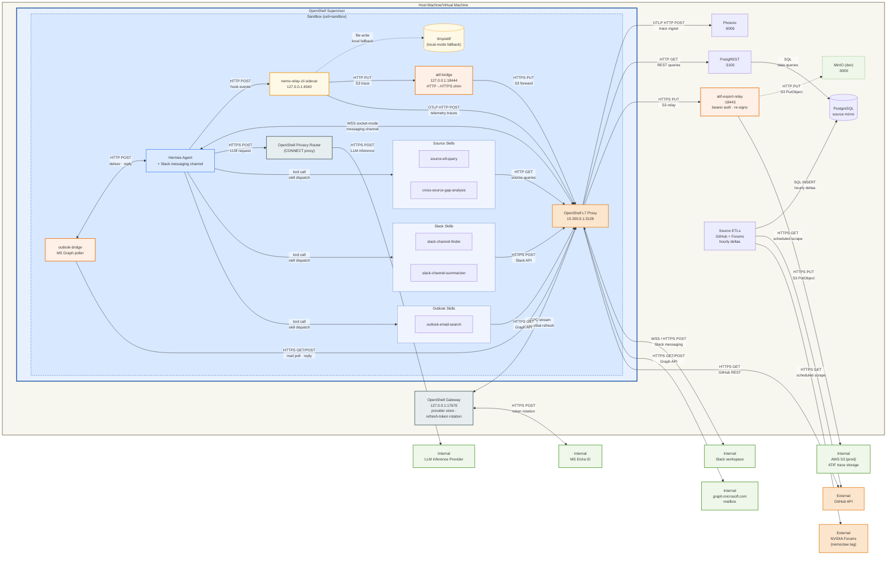

# personal-community-sentiment-triage: Hermes + Outlook

A personal Hermes agent that surfaces what the developer community is working
on, struggling with, asking about, and flagging as gaps — and compares it
against what internal developer/product teams are prioritizing, so resources
can be aligned against actual community demand. The agent draws on signal
from live GitHub repository state, mirrored GitHub discussions, NVIDIA forums,
and Slack channels; you interact with it via Outlook email and/or Slack.
Outlook is the recommended primary channel, but either is enough on its own —
at least one of the two must be configured.

## Deployment model

This is a personal agent designed to run on a **managed image/VM provisioned by
enterprise IT** (e.g. Ubuntu) — one you authenticate into, that ships sanctioned
pre-installed software and can reach only specific resources. The agent rides that
infrastructure with *delegated* access: its credentials live in OpenShell providers
(GitHub, Slack, Microsoft Graph), and it acts on your behalf within them.

Protection is layered. The managed image provides **coarse** protections (authenticated
access, a restricted set of reachable resources, host hardening). OpenShell adds
**workload-specific** protections on top: per-sandbox L7 egress allowlists, credential
placeholder substitution (real secrets never enter the sandbox), binary allowlists, and
Landlock/seccomp.

Concretely, the OpenShell gateway runs on that host under its **Docker compute driver**:
each sandbox is a host-networked container, and the agent reaches the example's host-side
services (the PostgREST forum bridge, ATIF export relay) through
`host.openshell.internal`. Under this driver the container is a thin, host-networked
execution layer — the meaningful workload boundary is OpenShell's policy/proxy/credential
and Landlock/seccomp enforcement, not the container itself. This is a single-host model,
not a Kubernetes/cluster deployment.

## Architecture

The Hermes sandbox operates with a deliberately narrow egress policy. It connects
live to Slack and Outlook for interactions and research. It also has
authenticated, read-only GitHub REST access to one configured repository
(`GITHUB_READONLY_REPO`). The GitHub token is attached through an OpenShell
provider placeholder so GitHub rate limits are practical, while `policy.yaml`
still limits the sandbox to repo-scoped `GET` requests. GitHub discussions,
historical mirror data, and NVIDIA forum data come from host-side ETL
containers that scrape on a schedule, write results into Postgres, and expose
that mirror through a read-only PostgREST HTTP bridge.



**Key invariants:**

- The agent has authenticated read-only `api.github.com` access for exactly one configured repo. The raw GitHub token stays in an OpenShell provider; the sandbox sees only a placeholder, and policy still blocks writes, non-API GitHub hosts, `git`, and `gh`.
- GitHub discussions, historical mirror data, and NVIDIA forum data come from the Postgres mirror.
- Slack and Outlook are live connections from the sandbox; the agent can read and write both in real time.
- Compatible-endpoint inference egress is required for the agent's LLM calls — it's not a research/data-ingestion path.
- The ETL containers are non-agentic — fixed scraper logic on an hourly interval, no LLM involvement.
- The PostgREST bridge exposes a read-only HTTP API on host port `3100`, and the sandbox reaches it through `host.openshell.internal` without any live forum egress.

## Agent skills

Skills are loaded on demand by the agent when relevant to a task. They live in [agents/hermes/skills/](agents/hermes/skills/).
0.0.
| Skill | Purpose |
|-------|---------|
| `github-readonly-live` | Query the configured live GitHub repo via authenticated, policy-scoped REST `GET` requests. |
| `source-etl-query` | Query the host-side PostgREST bridge for mirrored GitHub discussions, historical mirror data, and NVIDIA forum data. |
| `slack-channel-finder` | Discover Slack channels by topic, team, or domain and infer what each channel is for. |
| `slack-channel-summarizer` | Resolve Slack channels by name or ID and read message history via the Slack Web API. |
| `outlook-email-search` | Search the Outlook mailbox via Microsoft Graph to find and read emails relevant to a question. |
| `cross-source-gap-analysis` | Synthesize findings across Slack, GitHub, and NVIDIA forum sources to identify gaps, alignment issues, and follow-ups. |

## Intended user journey

The bring-up has two distinct halves: a host-side bootstrap (Docker services that hold
state across sandbox lifecycles) and an agent-side bring-up (the OpenShell sandbox
itself). The session UUID for Outlook gets produced *between* them, so the order matters.

### Phase 1 — Install prerequisites

```console
$ git clone https://github.com/NVIDIA/nemoclaw-community.git && cd examples/personal-community-sentiment-triage/
$ curl -LsSf https://raw.githubusercontent.com/NVIDIA/OpenShell/main/install.sh | OPENSHELL_VERSION=v0.0.53 sh
```

The package-managed installer starts a local gateway service for you. This
example assumes that default path and targets the `openshell` gateway at
`https://127.0.0.1:17670`. If you're following OpenShell's snap instructions
instead, set `OPENSHELL_GATEWAY=snap-docker` and
`OPENSHELL_GATEWAY_ENDPOINT=http://127.0.0.1:17670` in `.env`.

On Debian/Ubuntu the installer registers `openshell-gateway` as a **systemd
user service**, which only auto-starts when your user has an active systemd
session. Headless hosts (cloud shells, SSH-only VMs, CI runners) often don't,
so the service silently never starts and the first `openshell gateway add`
call fails with `mTLS certificates for gateway 'openshell' were not found`.
The fix, per the [OpenShell install docs](https://github.com/NVIDIA/OpenShell/blob/main/docs/about/installation.mdx#linux),
is to enable linger so the user manager boots without an interactive login:

```console
$ sudo loginctl enable-linger $USER
$ export XDG_RUNTIME_DIR=/run/user/$(id -u)   # only needed in shells started before linger
$ systemctl --user start openshell-gateway    # if not already started
$ systemctl --user status openshell-gateway   # verify
```

If `systemctl --user` returns `Failed to connect to bus: No medium found`
even after `enable-linger`, it's because the current shell predates the
user manager and doesn't know where the bus is. Either export
`XDG_RUNTIME_DIR` as shown above, or log out and reconnect — `pam_systemd`
sets it automatically once linger is on.

The service's `ExecStartPre` provisions the mTLS bundle the CLI needs, so
once the unit is `active (running)`, `bring-up.sh` can register the gateway.

This example uses OpenShell provider v2 (OAuth refresh-token rotation via
`openshell provider refresh configure`). Enable it once at gateway scope:

```console
$ openshell settings set --global --key providers_v2_enabled --value true --yes
```

`scripts/02-providers.sh` verifies this is set and refuses to run otherwise.

You also need a running Docker daemon. If you haven't already, register an Azure
application and a dedicated agent mailbox per [docs/set-up-outlook-bridge.md](docs/set-up-outlook-bridge.md)
— that's a one-time setup that produces your `OUTLOOK_CLIENT_ID` and `OUTLOOK_TENANT_ID`.

This example will download and install additional third-party open source software projects. Review the license terms of these open source projects before use. The repository-level `THIRD-PARTY-NOTICES` file tracks the expected inventory.

### Phase 2 — Pre-populate `.env` with what you know upfront

```console
$ cp .env.example .env
```

Now edit `.env` and fill in everything you already have:

- `COMPATIBLE_API_KEY` — your inference key
- **At least one messaging channel** — Outlook or Slack (or both):
  - **Outlook** (recommended primary channel): set **all four** Outlook vars together, or leave the entire block empty.
    - `OUTLOOK_TENANT_ID`, `OUTLOOK_CLIENT_ID` — from your Azure app registration
    - `OUTLOOK_TARGET_MAILBOX`, `OUTLOOK_REPLY_TO` — the agent's mailbox and your personal mailbox
  - **Slack**: `SLACK_BOT_TOKEN` / `SLACK_APP_TOKEN` (both required) — see [docs/set-up-slack.md](docs/set-up-slack.md). Partial Outlook configuration (some vars set, some empty) is rejected at bring-up.
- (optional) `SLACK_ALLOWED_IDS` — comma-separated Slack user IDs to restrict who can DM the agent; leave empty to allow anyone in the workspace
- (optional) `OUTLOOK_ALLOWED_SENDERS` — comma-separated allowlist of email senders the agent will respond to; leave empty to fall back to OUTLOOK_REPLY_TO
- (optional) `GITHUB_TOKEN` for authenticated sandbox read-only
  GitHub REST, `GITHUB_READONLY_REPO`,
  `PHOENIX_COLLECTOR_ENDPOINT`, `PHOENIX_PROJECT_NAME`

### Phase 3 — Host services (handled by bring-up.sh, no manual step)

[scripts/bring-up.sh](scripts/bring-up.sh) handles host services as its phase 1/4 by
invoking [scripts/00-host-services.sh](scripts/00-host-services.sh) before the
sandbox-side phases. The stack from [extras/docker-compose.yml](extras/docker-compose.yml)
— phoenix (telemetry), postgres (ETL backing store), source ETL workers, PostgREST on
host port 3100, plus minio + atif-export-relay when `ATIF_EXPORT_MODE=relay` — is
designed to outlive the sandbox, so subsequent `tear-down.sh && bring-up.sh` cycles
re-touch only the sandbox by default (00-host-services is idempotent).

You can also manage host services independently: `bash scripts/00-host-services.sh up`
or `bash scripts/00-host-services.sh down` for direct control without touching the
sandbox.

### Phase 4 — Bring up the agent

```console
$ bash scripts/bring-up.sh
```

The script auto-sources `.env`, then runs `01-gateway.sh` → `02-providers.sh` →
`03-sandbox.sh` (select or register the local OpenShell gateway, import v2 provider
profiles, upsert providers, build and launch the sandbox).

On the first bring-up with Outlook configured, `02-providers.sh` runs an interactive
Microsoft device-code login (it prints a URL + code; complete it in a browser as the
`OUTLOOK_TARGET_MAILBOX` user) and caches the resulting refresh token at
`.bootstrap/cache/ms-graph-token.json` (mode 0600; ignored by `.gitignore`). Subsequent
bring-ups reuse the cached refresh token (auto-refreshing on staleness ~90 days). Force
a fresh login with `OUTLOOK_LOGIN_CACHE=2 bash scripts/bring-up.sh`. Set
`OUTLOOK_LOGIN_CACHE=0` to skip the cache entirely and do device-code on every
bring-up — see [docs/set-up-outlook-bridge.md](docs/set-up-outlook-bridge.md#security-note-where-the-refresh-token-lives).

The image always installs NeMo-Relay so the agent writes ATIF traces to `/tmp/atif/`
regardless of Phoenix config. If `PHOENIX_COLLECTOR_ENDPOINT` is set, `03-sandbox.sh`
additionally bakes the endpoint into the image so OpenInference traces stream into
Phoenix at `http://localhost:6006`.

## What this example owns

- **Owns** (in this directory): `agents/hermes/` (the full Hermes asset tree, staged
  here for convenience), `policy.yaml` (sandbox network/filesystem policy template), `extras/`,
  `.env`, and `scripts/`:
  - `00-host-services.sh` — host-side stack lifecycle (phoenix, postgres, ETLs, postgrest, and minio + atif-export-relay when `ATIF_EXPORT_MODE=relay`). Idempotent; safe to invoke directly for `up` or `down`.
  - `01-gateway.sh` / `02-providers.sh` / `03-sandbox.sh` — sandbox-side phase scripts called by the bring-up orchestrator.
  - `bring-up.sh` — orchestrator: invokes `00-host-services.sh up` (phase 1/4) followed by 01 → 02 → 03 (phases 2-4/4). `00-host-services.sh` is idempotent, so re-running `bring-up.sh` on an already-up host stack is a no-op for those services and only re-runs the sandbox-side phases.
  - `tear-down.sh` — removes the sandbox and per-sandbox providers; preserves host services. Add `--stop-host-services` to also stop them (volumes preserved) or `--purge-host-services` to stop and wipe named volumes.
  - `snapshot.sh` / `restore.sh` — explicit Hermes state preservation across tear-down/bring-up cycles.
  - `download-traces.sh` — pull ATIF trace records from `/tmp/atif/` inside the sandbox into a host-side tarball. See [Capturing ATIF traces](#capturing-atif-traces) for the env knobs.
  - `host-tls-proxy.py` — optional plain-HTTP forwarder for hosts where the sandbox can't validate the inference endpoint's TLS chain (corporate VPN, split-horizon DNS, mkcert). See [docs/host-tls-proxy.md](docs/host-tls-proxy.md).
- **Generates and discards**: sed-patched `.Dockerfile.staged` and
  `.policy.staged.yaml` files at the example dir root. OpenShell does the actual
  build; we patch ARG defaults beforehand because `openshell sandbox create`
  doesn't expose `--build-arg`, and we patch the GitHub read-only repo scope
  from `.env` before applying the policy.

The example's Dockerfile drops the upstream `COPY nemoclaw-blueprint/` step —
nothing in the Hermes runtime reads `/sandbox/.nemoclaw/blueprints/`, so this
example is **fully self-contained** and never needs a NemoClaw checkout.

The Dockerfile always installs NeMo-Relay: it fetches the pinned, prebuilt
`nemo-relay-cli` release in a builder stage, upgrades Hermes to a version with
rich plugin hook payloads, and runs a sidecar gateway at startup. That is
enough for the agent to write ATIF trace records to `/tmp/atif/` — capture
them with [`scripts/download-traces.sh`](scripts/download-traces.sh).

Setting `PHOENIX_COLLECTOR_ENDPOINT` is a separate opt-in for live
OpenInference egress: when present, `03-sandbox.sh` bakes the URL into the
image so the agent streams traces to a Phoenix collector. The collector is
included in [extras/docker-compose.yml](extras/docker-compose.yml) and runs
on host port `6006`.

### Capturing ATIF traces

The agent writes ATIF (Agent Trajectory Format) records to `/tmp/atif/`
inside the sandbox on every turn. That directory is ephemeral — it lives
on the sandbox's writable layer and is destroyed by `tear-down.sh` — so
capture before destroying the sandbox if you want to keep the traces.

For production / always-on capture, set `ATIF_EXPORT_MODE=relay` (with
`ATIF_RELAY_BACKEND=minio` or `s3`) to have NeMo-Relay upload completed
trajectories to S3-compatible storage via a host-side relay. The sandbox never holds real
AWS credentials; OpenShell's provider store manages a per-sandbox bearer
token instead. See [docs/atif-export.md](docs/atif-export.md) for setup,
IAM template, and the auth model.

The on-disk capture below still works in parallel — it remains useful for
forensic captures and works regardless of whether the S3 backend is
configured.

```console
$ bash scripts/download-traces.sh
```

Writes `$EXAMPLE_DIR/.traces/atif-{ISO-timestamp}.tar.gz` plus a JSON
manifest sidecar. The tarball path is printed on stdout (progress goes to
stderr), so callers can capture it:

```console
$ TRACE=$(bash scripts/download-traces.sh)
```

Two env vars answer the "from where / to where" questions and can be
overridden at the call site:

| Env var | Default | What it controls |
|---|---|---|
| `SANDBOX_NAME` | `hermes-direct` | Which OpenShell sandbox to pull `/tmp/atif/` from. Shared with the rest of the example's scripts (defined in `_lib.sh`). |
| `TRACES_DIR` | `$EXAMPLE_DIR/.traces` | Host-side directory the tarball is written to. |

If `/tmp/atif/` is empty when the script runs (e.g. the agent hasn't had
a turn yet), the script still emits a valid empty tarball whose manifest
carries an explanatory `note` — downstream tooling never has to
special-case "no file."

**Lifecycle note**: no automatic rotation — files accumulate until
sandbox teardown. For long-lived sessions, prune manually inside the
sandbox, e.g. `find /tmp/atif -type f -mtime +7 -delete`.

## Prerequisites

- Docker daemon running.
- `openshell` CLI on PATH (installed transitively by the NemoClaw installer).
- `providers_v2_enabled` set globally on the OpenShell gateway
  (`openshell settings set --global --key providers_v2_enabled --value true --yes`).
- `.env` populated with the credentials below.
- **(Optional)** If your network performs TLS interception (e.g. an
  SSL-inspecting proxy), place the inspection CA certificate(s) as `.crt`
  files in the example-root `certs/` directory before running `bring-up.sh`.
  Otherwise leave it empty. See [`certs/README.md`](certs/README.md) for
  details.

## Providers created by `bring-up.sh`

Four of the five providers use custom v2 profiles in [providers/](providers/)
and are attached to the sandbox directly. Inference goes through OpenShell's
built-in `nvidia` v2 profile + `openshell inference set` + `inference.local`
routing for gateway-side hardening (streaming timeout, header sanitization,
model-ID enforcement, credential never enters the sandbox env). The custom
[`providers/compatible-endpoint.yaml`](providers/compatible-endpoint.yaml) is
checked in as a forward-looking placeholder for when OpenShell adds inference-
route auto-creation from `inference_capable` v2 profiles; until then it's not
imported. The agent calls each non-inference upstream directly with a placeholder
bearer header; the OpenShell L7 proxy substitutes a live token on egress.

| Provider name | `--type` | Credential env var | Required? |
|---|---|---|---|
| `compatible-endpoint` | `nvidia` (built-in v2; consumed via `openshell inference set`, not attached to the sandbox directly) | `NVIDIA_API_KEY` (populated from `OPENAI_API_KEY` / `COMPATIBLE_API_KEY` at provider-create time). URL: `NEMOCLAW_ENDPOINT_URL` → `NVIDIA_BASE_URL` provider config. Routing via `inference.local`. | Required for inference. If omitted, the agent has no LLM. |
| `<sandbox>-outlook` | `nemoclaw-outlook-email` | `MS_GRAPH_ACCESS_TOKEN` (auto-rotated by the gateway from the registered refresh token). Refresh material: `OUTLOOK_TENANT_ID`, `OUTLOOK_CLIENT_ID`, refresh_token (cached from device-code login). | Optional. Created only when the Outlook block is fully populated; partial config is rejected. At least one of Outlook or Slack must be configured. |
| `<sandbox>-slack` | `nemoclaw-slack` | `SLACK_BOT_TOKEN` (Web API) + `SLACK_APP_TOKEN` (Socket Mode) | Optional. Both credentials are `required: true` on the profile — partial Slack config fails at provider-create time. At least one of Outlook or Slack must be configured. |
| `<sandbox>-github` | `nemoclaw-github` | `GITHUB_TOKEN` | Optional but recommended. Enables authenticated live GitHub REST reads. The sandbox receives only the OpenShell placeholder; `policy.yaml` further limits use to repo-scoped `GET` routes from approved binaries. |

The `compatible-endpoint` provider is **not** prefixed with the sandbox name — it's a
shared inference provider attached via `--provider compatible-endpoint` on sandbox
create, the same way every other v2 provider is attached. The agent dials the upstream
host directly; the L7 proxy substitutes the `OPENAI_API_KEY` placeholder on egress.

### How `policy.yaml` and provider profiles compose

Sandbox network policy ([`policy.yaml`](policy.yaml)) layers on top of the per-provider
endpoint scopes above. For most providers the profile is the sole source of policy;
`policy.yaml` only carries restrictions that the v2 ProviderProfile schema can't
express today — specifically per-path allow rules (used to scope the NVIDIA inference
API to specific `/v1/*` paths and GitHub reads to one repo via `GITHUB_READONLY_REPO`)
and credential-less host-routed services (Phoenix collector, Source-ETL API). Surviving
`network_policies` blocks in `policy.yaml` carry **load-bearing comments** explaining
why they can't be folded into provider profiles. Fully-redundant blocks (e.g. the
former `slack` block) have been removed.

`GITHUB_TOKEN` is attached as `<sandbox>-github` for live sandbox GitHub reads.
The sandbox sees only an OpenShell placeholder;
the raw token is resolved by the proxy on egress. GitHub write attempts are
still blocked by the applied policy, which allows only selected `GET` paths
under `api.github.com/repos/$GITHUB_READONLY_REPO`. If you keep the optional
host GitHub mirror enabled, it also reads `GITHUB_TOKEN` for API rate limits.

## Changing the available live GitHub repo

The live GitHub policy is repo-scoped. To change the repo the sandbox can read:

1. Set `GITHUB_READONLY_REPO=owner/repo` in `.env`.
2. For practical API rate limits, set `GITHUB_TOKEN`. Private
   repos require a token with access to the target repo; public repos can be
   read without a token but use GitHub's lower unauthenticated API limits.
3. Recreate the sandbox so `scripts/03-sandbox.sh` can stage the Dockerfile env
   and apply a policy for the new repo:

```bash
bash scripts/tear-down.sh
bash scripts/bring-up.sh
```

For normal repo changes, do not edit `policy.yaml` by hand; `03-sandbox.sh`
patches the `__GITHUB_READONLY_REPO__` placeholder before applying the staged
policy. After bring-up, verify the live repo path from the host shell:

```bash
set -a; . ./.env; set +a
openshell sandbox exec --name "${SANDBOX_NAME:-hermes-direct}" -- sh -lc \
  '/usr/bin/python3 /sandbox/.hermes-data/skills/github-readonly-live/scripts/github_readonly.py get . --fields full_name,default_branch,open_issues_count'
```

`GITHUB_READONLY_REPO` controls only live REST reads through
`github-readonly-live`. The host-side ETL mirror is independent; set
`SOURCE_ETL_GITHUB_REPO=owner/repo` if you also want mirrored GitHub
discussions/history from a different repo, then rerun
`bash scripts/00-host-services.sh`. Existing mirror database/state is preserved
unless you remove the compose volumes.

## Configuration knobs (all env vars)

| Var | Default | What it does |
|---|---|---|
| `SANDBOX_NAME` | `hermes-direct` | OpenShell sandbox name. Default avoids clobbering `nemoclaw-hermes`. |
| `OPENSHELL_GATEWAY` | `openshell` | Gateway name. The default matches the package-managed OpenShell installer. Use `snap-docker` when following the snap setup. |
| `OPENSHELL_GATEWAY_ENDPOINT` | auto (`https://127.0.0.1:17670` for `openshell`, `http://127.0.0.1:17670` for `snap-docker`) | Override the local gateway endpoint if you registered it under a different URL. |
| `NEMOCLAW_MODEL` | `nvidia/nemotron-3-super-120b-a12b` | Inference model passed to `openshell inference set`. |
| `NEMOCLAW_ENDPOINT_URL` | `https://integrate.api.nvidia.com/v1` | Upstream base URL for the `compatible-endpoint` provider. (`OPENAI_BASE_URL` is also accepted as a fallback.) |
| `COMPATIBLE_API_KEY` | (none) | Inference API key. Mirrors NemoClaw's `REMOTE_PROVIDER_CONFIG.custom`. (`OPENAI_API_KEY` is also accepted.) |
| `GITHUB_TOKEN` | (none) | Optional GitHub token for authenticated live REST reads. Also feeds the optional host GitHub mirror. |
| `GITHUB_READONLY_REPO` | `NVIDIA/OpenShell` | The only repo allowed by the live GitHub REST policy, formatted as `owner/repo`. Recreate the sandbox after changing it. |
| `SOURCE_ETL_GITHUB_REPO` | `NVIDIA/NemoClaw` | Host-side GitHub mirror repo for source-etls. This is independent of `GITHUB_READONLY_REPO`. |
| `OUTLOOK_LOGIN_CACHE` | `1` | Controls the Microsoft refresh-token cache at `.bootstrap/cache/ms-graph-token.json`. `1` = use the cache (auto-refresh on staleness, ~90 days). `0` = skip the cache entirely (device-code every bring-up, nothing on disk; use on shared workstations or security-sensitive contexts). `2` = force device-code login and rewrite the cache. The gateway-side encrypted credential copy is unaffected by this knob. |
| `PHOENIX_COLLECTOR_ENDPOINT` | (none) | Set to e.g. `http://host.openshell.internal:6006/v1/traces` to stream OpenInference traces to a Phoenix collector. ATIF trace generation does not depend on this — NeMo-Relay is always installed and writes ATIF locally to `/tmp/atif/` regardless. |
| `PHOENIX_PROJECT_NAME` | `default` | Sets `openinference.project.name` on every exported span so Phoenix routes traces to a named project. Override per-build to keep multiple deployments separate in the same Phoenix instance. |

## Verification (what success looks like)

The plumbing checks below confirm the bridge and skill scripts are wired correctly. For an end-to-end walkthrough that exercises each skill via Slack DM and Outlook email, see [docs/verify-functionality.md](docs/verify-functionality.md). For a cross-channel, multi-user demo where one user teaches the agent a new skill and a different user invokes it from a different channel after a full sandbox rebuild, see [docs/collective-wisdom.md](docs/collective-wisdom.md).

```console
$ set -a; . ./.env; set +a

$ openshell sandbox list                      # hermes-direct should be ready
$ openshell sandbox exec --name hermes-direct -- \
    curl -sf http://localhost:8642/health     # {"status":"ok",...}
$ openshell sandbox exec --name hermes-direct -- \
    ls /usr/local/lib/nemoclaw-bridges/outlook/  # bridge present

# Verify the v2 outlook provider's gateway-managed refresh works end-to-end.
# The L7 proxy substitutes the placeholder with a live access token on egress.
$ openshell sandbox exec --name hermes-direct -- \
    curl -sS -H "Authorization: Bearer openshell:resolve:env:MS_GRAPH_ACCESS_TOKEN" \
      'https://graph.microsoft.com/v1.0/me' | head -c 300

$ openshell sandbox exec --name hermes-direct -- env \
    OUTLOOK_TARGET_MAILBOX="$OUTLOOK_TARGET_MAILBOX" \
    /usr/bin/python3 /sandbox/.hermes-data/skills/outlook-email-search/scripts/search_emails.py \
      --query "nemoclaw" --since 7d           # {"ok": true, "count": N, ...}
```

> **Note 1:** `openshell sandbox exec` requires `--name <SANDBOX>` and a `--` separator before the command — without them, the sandbox name is parsed as the command itself (`hermes-direct: command not found`).
>
> **Note 2:** The verification points the search at `OUTLOOK_TARGET_MAILBOX` (the bot's own mailbox) because the delegated token always has access to it. Substituting `OUTLOOK_REPLY_TO` to query your *personal* mailbox via shared-folder access requires you to have granted the bot account delegate access in Outlook (**Outlook → File → Account Settings → Delegate Access**, or send a folder-share invitation); without that, Graph returns `HTTP 403: Cannot find row based on condition.`

## Tear-down

```console
$ bash scripts/tear-down.sh
```

Removes the sandbox, the Outlook/GitHub/Slack providers, and any leftover
staged Dockerfile/policy files. **Does not** destroy the gateway or stop host services
(phoenix, postgres, ETLs, postgrest) by default — those are
typically long-lived. Opt-in flags (mutually exclusive):

- `--stop-host-services` — also stop the [extras/](extras/) stack (volumes preserved; delegates to `00-host-services.sh down`).
- `--purge-host-services` — also stop the stack AND wipe its volumes. Forces ETL re-scrape on the next `up`. Delegates to `00-host-services.sh down --volumes`.

Manual cleanup for less-common operations:

- `openshell gateway destroy --name "${OPENSHELL_GATEWAY:-openshell}"` — destroy the gateway (substitute `snap-docker` if you registered it under that name).
- `openshell provider delete compatible-endpoint` — remove the shared inference provider.

To stop *just* the host services without removing the sandbox:

```console
$ bash scripts/00-host-services.sh down
```

Add `--volumes` (or `-v`) to also wipe the source-etls Postgres data (forces ETL re-scrape on the next `up`). Outlook re-auth is independent — re-run `bash scripts/bring-up.sh` with `OUTLOOK_LOGIN_CACHE=2`.

## Persistence: collective wisdom across restarts

What survives a `tear-down.sh && bring-up.sh` cycle by default:

- **Postgres ETL data** — backed by the named Docker volume `source-etls-postgres-data` in [extras/docker-compose.yml](extras/docker-compose.yml). Survives unless you opt in to `--purge-host-services` (or run `bash scripts/00-host-services.sh down --volumes` directly).
- **Host services state** (phoenix's traces) — also volume-backed.
- **Microsoft refresh token** (in `.bootstrap/cache/ms-graph-token.json`; ignored by `.gitignore`) — survives tear-down/bring-up cycles, auto-refreshed on staleness. Set `OUTLOOK_LOGIN_CACHE=2` to force a fresh device-code login + cache rewrite, or `OUTLOOK_LOGIN_CACHE=0` to skip the cache altogether.

What does **not** survive by default:

- **Hermes's accumulated state** under `/sandbox/.hermes-data/` (memories, sessions, learned skills, scheduled cron, conversation history). The sandbox container is destroyed on tear-down; the writable layer goes with it.

This example ships [scripts/snapshot.sh](scripts/snapshot.sh) and [scripts/restore.sh](scripts/restore.sh) for explicit state preservation. OpenShell's CLI does not expose a `sandbox stop`/`start` pair (the lifecycle is `create` / `delete`), so snapshot-as-tarball is the durable path.

```console
# 1. Capture state from a running sandbox.
$ bash scripts/snapshot.sh
$ ls .snapshots/                              # tarball + manifest.json

# 2. Tear down completely.
$ bash scripts/tear-down.sh

# 3. Bring up a fresh sandbox.
$ bash scripts/bring-up.sh

# 4. Re-hydrate. Defaults to the most recent snapshot in .snapshots/.
$ bash scripts/restore.sh

# 5. Reconnect — Hermes recalls what it learned in step 1.
$ openshell sandbox connect hermes-direct
```

To pin a specific snapshot instead of the latest, pass the path:
`bash scripts/restore.sh .snapshots/2026-05-07T19-03-22Z.tar.gz`.

[scripts/snapshot.sh](scripts/snapshot.sh) excludes obvious credential-bearing files (`.env`, `*secret*`, `*token*`, `auth-profiles*`, etc.) so the tarballs are safe to share — same spirit as NemoClaw's upstream `createSnapshotBundle()` redaction, with file-level exclusion in place of content-aware redaction.

The `.snapshots/` directory is `.gitignore`'d.

For a hands-on demo of this in action — including a learned skill surviving a full rebuild and being invoked by a different user from a different channel — see [docs/collective-wisdom.md](docs/collective-wisdom.md).
