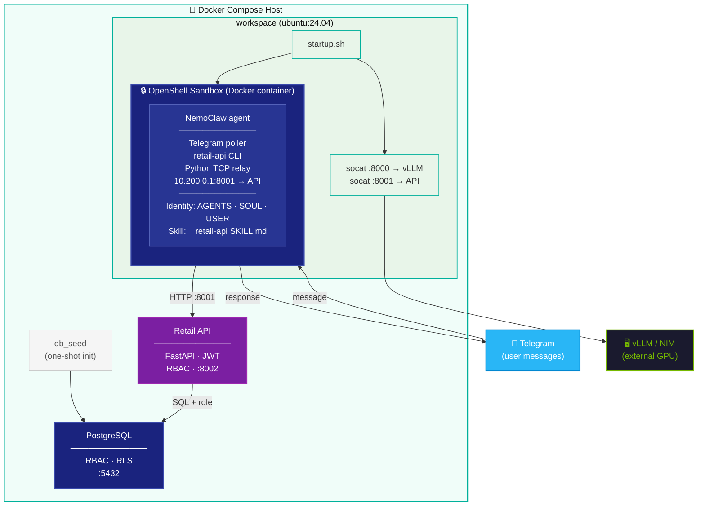

# NemoClaw Retail Demo

NemoClaw is an AI-powered retail management assistant that lets store employees interact with company data through natural conversation - no dashboards, no SQL, no training required. Users connect via Telegram and ask questions or trigger operations naturally: check inventory, request stock transfers, query sales trends.

Built on the **NVIDIA NemoClaw open-source agentic framework**, the assistant is shaped by a custom identity layer (AGENTS.md · SOUL.md · USER.md) and a retail-specific skill set. All operations run inside a sandboxed environment. Authentication is Telegram-native: each user is automatically mapped to their role and store via the `TelegramAuth` table - no passwords involved.

## Deployment Approaches

| Approach | Path | Best for |
|---|---|---|
| **Docker Compose** | [`docker-compose/`](docker-compose/README.md) | Single-machine demo, local development |
| **Helm (Kubernetes)** | [`helm/`](helm/README.md) | Production-grade, multi-node K8s cluster |

Each approach has its own README with deployment-specific instructions. This file covers everything common to both.

## Architecture

The diagram below shows the Docker Compose deployment. The Helm/Kubernetes deployment follows the same logical flow but replaces Docker socket management with K8s sidecars and service DNS.



In both deployments, the agent runs inside an **OpenShell sandbox** — an isolated container with a restricted network namespace. Exec-tool child processes can only reach `10.200.0.1` (veth bridge), which is why a Python TCP relay forwards API calls from inside the sandbox to the workspace's socat proxy.

## Prerequisites

- A **Telegram bot token** and your **Telegram user ID** (see [Getting Your Telegram Credentials](#getting-your-telegram-credentials))
- A deployed **LLM with tool calling support** (see [LLM Inference Endpoint](#llm-inference-endpoint))
- Docker (Compose approach) or a Kubernetes cluster with Helm (K8s approach)

## Identity Layer

Both deployment approaches share the same identity files that define the agent's behaviour:

| File | Purpose |
|---|---|
| `identity/AGENTS.md` | Tone, response format, and presentation rules. Defines how the agent communicates — never Markdown tables, bullet lists, 4000 char limit. |
| `identity/SOUL.md` | Auth enforcement, RBAC rules, tool usage restrictions, schema facts, security boundaries. The agent's security contract. |
| `identity/USER.md` | Runtime user context. Derives the user's name from their email, detects language, scopes operations to their store by default. |
| `skills/retail-api/SKILL.md` | Retail API skill — lazy-loaded on demand. Contains the full command reference for the retail API CLI. |

The `startup.sh` (both approaches) injects these files into the OpenShell sandbox at deploy time via `patch-openclaw.py`.

## LLM Inference Endpoint

NemoClaw requires an OpenAI-compatible endpoint with **tool calling** enabled. Without it the agent cannot call the retail API.

This demo is optimised for **NVIDIA Nemotron-3-Super 120B A12B FP8**, deployed with vLLM and MTP (Multi Token Prediction) for faster inference, in 2 H200 GPUs:

```bash
docker run --gpus '"device=1,2"' --name nemotron-super -p 8070:8000 --ipc=host \
  -v ~/.cache/huggingface:/root/.cache/huggingface \
  -e HF_TOKEN=$HF_TOKEN \
  -e VLLM_FLASHINFER_MOE_BACKEND=latency \
  -e VLLM_USE_FLASHINFER_MOE_FP8=1 \
  vllm/vllm-openai:latest \
  --model nvidia/NVIDIA-Nemotron-3-Super-120B-A12B-FP8 \
  --trust-remote-code \
  --dtype auto \
  --kv-cache-dtype fp8 \
  --tensor-parallel-size 2 \
  --enable-expert-parallel \
  --enable-prefix-caching \
  --gpu-memory-utilization 0.85 \
  --max-model-len 131072 \
  --enable-chunked-prefill \
  --max-num-batched-tokens 16384 \
  --max-cudagraph-capture-size 1024 \
  --mamba-ssm-cache-dtype float32 \
  --default-chat-template-kwargs '{"enable_thinking": false}' \
  --enable-auto-tool-choice \
  --tool-call-parser qwen3_coder \
  --speculative-config '{"method": "nemotron_h_mtp", "num_speculative_tokens": 3}'
```

Once running, set your `.env` accordingly:
```env
DYNAMO_HOST=<host>:8000
NEMOCLAW_MODEL=nvidia/NVIDIA-Nemotron-3-Super-120B-A12B-FP8
```

## Optimize Your Model

Three parameters in `.env` let you tune inference behaviour without touching the code:

### 1. Limit `OPENCLAW_MAX_TOKENS`

```env
OPENCLAW_MAX_TOKENS=4096
```

NemoClaw responses are short by nature - a retail query answer rarely exceeds a few hundred tokens. The smaller this value, the faster the model stops generating and returns a response. **Start at `4096` and only increase if you see responses getting cut off.** The value (`8192`) is a safe ceiling for complex multi-table queries.

### 2. Disable reasoning if your model supports it

Models with built-in reasoning (chain-of-thought, thinking tokens) will overthink simple retail queries — adding latency without improving accuracy. If your model supports a `enable_thinking` flag, disable it at the vLLM level:

```bash
--default-chat-template-kwargs '{"enable_thinking": false}'
```

This is already included in the Nemotron-Super launch command above. For other models, check the model card for the equivalent flag. Disabling reasoning is one of the highest-impact latency optimisations for agentic retail workloads.

## Getting Your Telegram Credentials

### 1. Create a Telegram Bot

1. Search for **@BotFather** in Telegram
2. Send `/newbot` and follow the prompts
3. Copy the **bot token** — looks like `123456789:ABCdefGHIjklMNOpqrsTUVwxyz`

### 2. Get Telegram User IDs

1. Search for **@userinfobot** in Telegram
2. Send `/start` — it replies with your **numeric user ID**

`TELEGRAM_USER_ID` accepts a comma-separated list for multiple users (e.g. `123456789,987654321`). Each user must also have a row in the `TelegramAuth` database table (seeded from `synthetic_data/csv/TelegramAuth.csv`).

## Adding a User

Two steps are always required. An optional third step applies when the person has no employee record yet.

### Step 1 — Whitelist the Telegram ID

Add the numeric Telegram ID to the allowed user list in your deployment config (`.env` for Docker Compose, `values.yaml` for Helm).

### Step 2 — Map the Telegram ID to an employee

Add a row to `TelegramAuth.csv` (Docker Compose: `synthetic_data/csv/TelegramAuth.csv` / Helm: `files/csv/TelegramAuth.csv`):

```csv
telegram_id,employee_id
NEW_TELEGRAM_ID,<employee_id>
```

The `employee_id` must match a record in `Employees.csv`. This determines the user's role (`country_manager`, `store_manager`, or `data_analyst`) and, for store managers, their `store_id` scope.

### Step 3 (optional) — Create the employee record

If the person does not have an existing employee record, add a row to `Employees.csv` first:

```csv
employee_id,first_name,last_name,role,store_id,email
<next_id>,First,Last,<role>,<store_id or blank>,first.last@retaildemo.com
```

Valid roles: `country_manager`, `store_manager`, `data_analyst`.  
Leave `store_id` blank for `country_manager` and `data_analyst`.

> ⚠️ After editing CSVs you must fully redeploy to reseed the database. See the deployment-specific README for the exact command — **do not skip the volume wipe step or the new user will not be inserted**.

## Database

PostgreSQL with three roles enforced at the database level via Row Level Security:

- **`nemoclaw_country_manager`** — full read/write across all stores
- **`nemoclaw_store_manager`** — read across all stores; write only to own store. RLS on `InventoryTransfers` and `ReorderRequests` blocks cross-store writes at DB level.
- **`nemoclaw_data_analyst`** — read-only across all stores

Authentication is Telegram-native: the `TelegramAuth` table maps Telegram user IDs to employee records. No passwords are passed through the agent.

Pre-built views available for common queries: `InventoryAvailable`, `LowStockAlerts`, `Customer360`, `SalesPerformanceByStore`, `TopProductsByRevenue`, `ActivePromotions`.


## Credits
This contribution was done by the HPE AI Services members: 

- [Paula Serna](https://github.com/paulaserna16). HPE AI & Data Technical Consultant. 
- [Sergio Donis](https://github.com/sdonis). HPE AI & Data Technical Consultant. 
